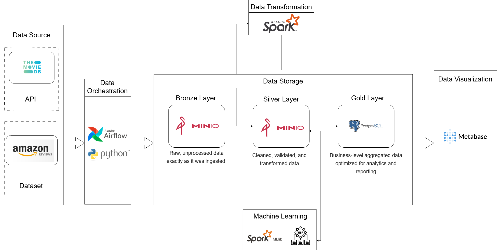

### Kiến trúc

### Các bước thực hiện
## 1. Clone repository về
## 2. Tạo file .env
Trong file env tạo `TMDB_READ_ACCESS_TOKEN =<token của TMDB_READ_ACCESS_TOKEN >` 
Tạo thêm `MINIO_ENDPOINT =<trong file docker-compose có>`
Tạo thêm `MINIO_ROOT_USER =<trong file docker-compose có>`
Tạo thêm `MINIO_ROOT_PASSWORD  =<trong file docker-compose có>`
## 3. Lấy dữ liệu về
Đầu tiên tạo 1 thư mục dataset trong thư mục ingestion
vào trang web này
https://amazon-reviews-2023.github.io/
tìm Movies_and_TV vào tải 2 file review và meta vào trong thư mục dataset
Chạy 2 file tmdb và run trong thư mục ingestion
## 4. To be continue...